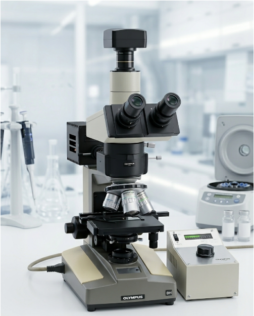
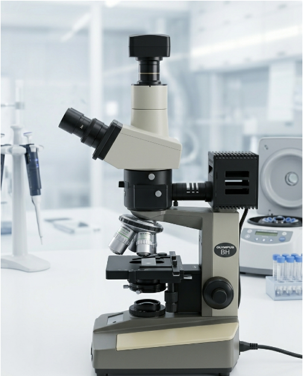
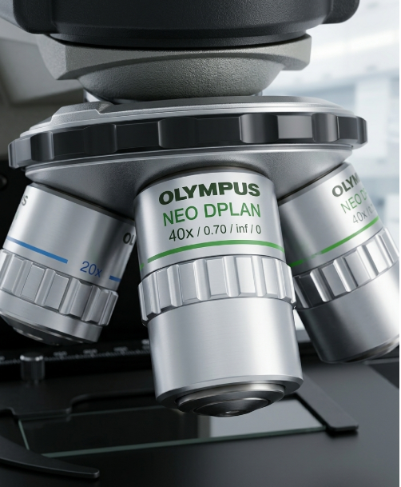
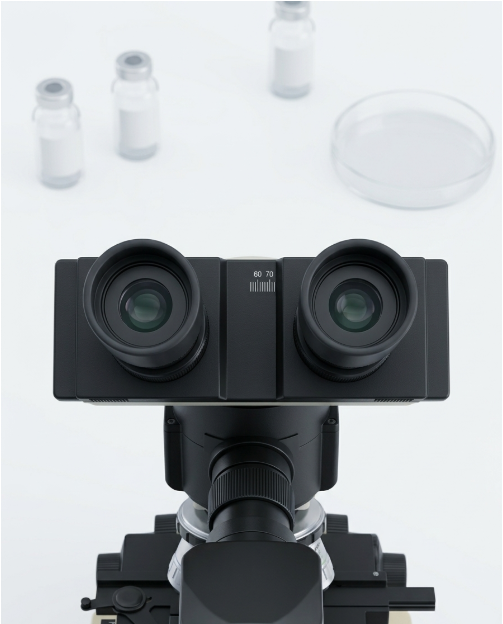
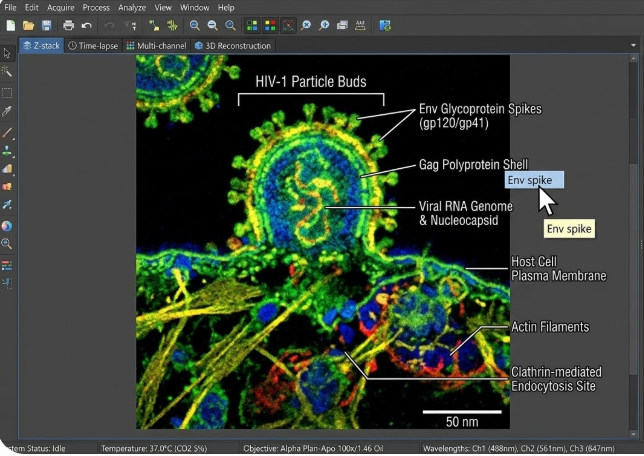

# AI Microscope

**Exploring Computer Vision and Machine Learning principles for optical microscopy**

*A personal research project.*

---

This repository started with one evening and one microscope.

Late December 2023. I was sitting in front of an old Olympus BH microscope, trying to identify a mineral in a petrographic thin section — and getting frustrated. The focus kept drifting. The illumination was uneven, the right edge of the frame noticeably darker than the left. And to get an actual identification, I would have had to carry the sample to a lab, wait a week, and pay good money for something I was convinced could be done in software.

That evening, a thought struck me: the camera on the trinocular tube sends 30 frames per second. Each frame is a two-dimensional array of brightness values. And evaluating the sharpness of a two-dimensional array — that's a problem mathematicians solved decades ago. Evaluating illumination uniformity was solved even earlier, back in the 1940s when Ansel Adams invented his zone system. And image classification — well, neural networks had recently done things that seemed flatly impossible just five years before.

The technology was almost ready. Almost — but not quite. Runtime inference engines hadn't reached the speed needed for real-time processing on ordinary hardware. Open-source microscopy models were immature. Browser-based video streaming frameworks had latency that made interactive focusing unusable.

So I started this project as a notebook. Collecting principles. Thinking through architecture. Waiting for the technology to catch up. More than two years have passed since that evening. The technology caught up. The project grew with it.

What you'll find here is what I've arrived at: the theoretical foundations, engineering principles, and approaches that sit underneath the AI Microscope platform. Not code — principles. Physics, optics, mathematics, machine learning.

---

*Trinocular head: two eyepieces for the operator, third tube for the camera. This is where analog optics meets digital processing.*

---

## The focusing problem: what mathematics has to say

A microscope operator judges focus by eye. This is subjective. It depends on fatigue, on visual adaptation, on what that particular operator considers "sharp enough." Mathematics offers an objective alternative — and more than one.

Image sharpness is a measure of spatial frequency content. The more high-frequency components in a frame, the sharper it is. A blurred frame is one where high frequencies have been suppressed by the point spread function (PSF) of the optical system.

There is an entire family of metrics that quantify this. Each one has its own mathematical nature and its own blind spots.

Gradient-based metrics — Tenengrad, built on the Sobel operator from 1968 — compute the magnitude of brightness gradients: how rapidly pixel intensity changes between neighbors. High gradient means sharp edges means the image is in focus. But on low-contrast specimens where edges are inherently diffuse (phase objects, unstained cells), the gradient can be low even at perfect focus.

The Laplacian (second derivative, known as Laplacian Variance in the focusing literature) catches what the gradient misses — fine texture, granularity, surface microrelief. But it's noise-sensitive. On high-ISO frames from cheap USB cameras, the Laplacian can report "maximum sharpness" on a frame that is actually just noisy.

Autocorrelation metrics — Vollath F4, described by Vollath in 1987 — work on a different principle entirely. They evaluate how well a pixel's brightness predicts its neighbor's brightness. In a sharp image, the correlation is high (an edge stays an edge one pixel over). In a blurred image, correlation drops. This approach is mathematically robust against noise, which makes it the only reliable metric at ISO 1600–3200 on budget cameras.

Normalized Variance solves yet another problem: invariance to brightness. If the operator is simultaneously turning the focus knob and adjusting the lamp (which happens more often than you'd think), absolute metrics drift. Dividing variance by mean brightness compensates for this.

None of these metrics is "the best." Each is optimal within its own range of conditions. This is precisely why the sound approach is to compute several metrics in parallel with adaptive weighting.

---

*NEO DPLAN 40×/0.70 — numerical aperture of 0.70 sets the diffraction-limited resolution. At 550 nm wavelength, that's roughly 0.48 µm by the Rayleigh criterion. No software will exceed this limit — but software can guarantee you actually reach it.*

---

## Illumination: a zone system for microscopy

Ansel Adams developed the zone system in the 1940s, dividing the tonal range into eleven zones — from featureless black to featureless white. A photographer could precisely control which details would fall into which zone. This principle transfers to microscopy with surprising elegance.

A microscope's field of view is not uniformly illuminated. Condenser lenses produce vignetting — brightness falls off from center to edge. For visual observation, this is often invisible (the brain compensates). But for quantitative analysis — cell counting, optical density measurement, spectral work — it's a disaster. An object at the edge of the field appears darker than the identical object at the center.

A zone-based uniformity metric divides the frame into a grid (Adams' principle) and compares brightness statistics across zones. The center zone carries greater weight — in microscopy, the object of interest is almost always near the center of the field.

Clipping is a separate concern. When pixels hit 0 (black) or 255 (white), information at those points is irreversibly lost. The sensor cannot record what exceeds its dynamic range. Real-time clipping detection is essentially the exposure warning from professional cameras, adapted for microscopy.

White balance, dynamic range, gamma response — each of these parameters is formalized in photometry and colorimetry standards (CIE, ISO 12232). There is no need to reinvent them. The work lies in adapting them to the specifics of microscopic imagery.

---

## Auto-detection of microscopy type

This is the least obvious part — and one of the most important.

A microscope can operate in several modes: brightfield, darkfield, fluorescence, phase contrast, polarization, reflected light, differential interference contrast (DIC). Each mode produces images with fundamentally different statistics.

In darkfield, the background is black and objects are bright — the histogram is left-skewed with isolated peaks. In fluorescence, the background is also dark, but noise follows a Poisson distribution (photon noise), and the signal can be faint — tens of photons per pixel. In polarized light, interference colors appear that exist in no other mode. Phase contrast produces characteristic halos around objects (the Zernike ring artifact).

A processing algorithm that works perfectly for one mode is destructive for another. Contrast enhancement that performs brilliantly in brightfield will kill a weak fluorescence signal. Noise reduction tuned for Gaussian noise in brightfield will distort the Poisson noise of fluorescence. A brightness threshold that's correct for darkfield will clip all useful information in brightfield.

Statistical classification of the mode from the frame's own properties — brightness distribution, characteristic patterns, spectral profile — allows automatic selection of the right processing pipeline. The operator switches the mode on the microscope — the software adapts.

*Eyepieces with diopter scale. Everything the operator's eye sees through this optics, the camera on the third tube sees too — and can process every single frame.*

---

## Machine learning: from pixels to diagnosis

Improving the image is half the job. The real question is: what's in it?

Object classification in microscopic images is a task that convolutional neural networks handle well. A trained model takes in a tensor (a normalized image of fixed dimensions), passes it through layers of convolutions, pooling, and fully connected operations, and outputs a probability vector across classes. For mineralogy, a class is "olivine" or "pyroxene." For hematology — "neutrophil" or "lymphocyte." For defect inspection — "micropore" or "crack."

The key architectural idea is modularity. Each subject domain (mineralogy, parasitology, textiles, botany) is a separately trained model with its own class set. One platform, many "eyes," each trained to see its own thing. Adding a new domain doesn't require changing the architecture — only a trained model and a configuration.

Inference (applying a trained model to new data) must run on ordinary hardware without a server GPU. Modern runtime engines make this possible: a model trained on a powerful GPU can execute on a laptop with a regular processor — slower, but fast enough for microscopy, where the specimen isn't going anywhere.

Open datasets are the foundation. The scientific community has published hundreds of annotated microscopic image collections: blood cells, malaria parasites, mineral thin sections, weld defects, textile fibers, fungal spores, plant pollen. Each dataset represents years of researchers' work in manual annotation. Training models on this data is standard practice in modern machine learning.

*The diagnostic overlay principle: classification results are rendered on top of the live image. Each annotation is the output of an ML model — class label and confidence score.*

---

## Application domains

A geologist finds a rock in the field and wants to know the mineral composition from a thin section's optical properties — birefringence, pleochroism, extinction angle. A metallurgical engineer examines a weld microstructure — looking for micropores, cracks, assessing grain size. An ecologist filters a water sample and counts microplastic particles. A botanist scrapes a wall and identifies the fungal species by spore morphology. A textile analyst checks fabric composition — fiber type is determined by cross-section shape: triangular means silk, circular means polyester, ribbon-shaped with a lumen means cotton.

Each of these tasks is solved by a trained model. Each model is a separate module.

---

## Theoretical foundations

Everything described in this repository is grounded in published scientific work and established theory:

Sharpness evaluation — Tenengrad (Tenenbaum, 1970), Laplacian Variance (Pech-Pacheco et al., 2000), Vollath F4 (Vollath, 1987), Normalized Variance (Groen et al., 1985)

Zone system of exposure — Adams A., *The Negative* (1981)

Diffraction-limited resolution — Rayleigh criterion, d = 0.61λ/NA

Microscopy modalities — Zernike (phase contrast, Nobel Prize 1953), Nomarski (DIC, 1952)

Convolutional neural networks — LeCun et al. (1998), He et al. (ResNet, 2015)

Edge inference — ONNX standard (Open Neural Network Exchange)

---

*This repository documents a research process. It contains no executable code, no medical recommendations, and no commercial products. All principles described are based on published scientific work.*

